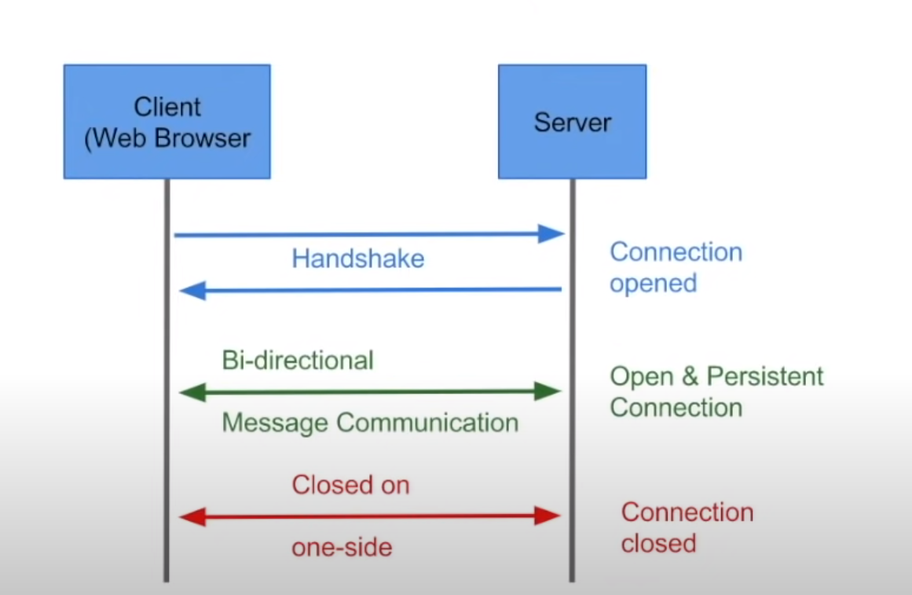

# WebSockets

### How does a HTTP protocol works? 

=>  

Request --> response .  

When the request is sent there will be a TCP connection created between client and the server. Once the response is received this connection is closed. Uni-directional protocol. 

 

If a website giving 5 different request to the webserver, there will be 5 different connection created separately.  

 

This is how http/https works... the Rest connection also works in the same way. New connection is created every single times. 

 

### What are WebSockets? 

 

There is bidirectional communication between client and the server in the websockets. 

 

WebSockets follows the following format: 

 * ws://www.google.com 

* wss://www.google.com 

  

 They don't close the connection, it stays open for the first time. Whenever client has established a connection between the server it stays open.  

 

    <strong>Figure:</strong> WebSocket's working mechanism

 

## Where and when can WebSockets be used? 

* Real time Applications (like trading app)  

* Gaming applications (in web-browser) 

* Chat Applications 

 

 
When creating a socket connection between client and servers refreshing the page makes the data lost. 

 

## When not to use WebSockets!? 

* Real time updates are not required 

* Restful services are sufficient to get data from the server. 